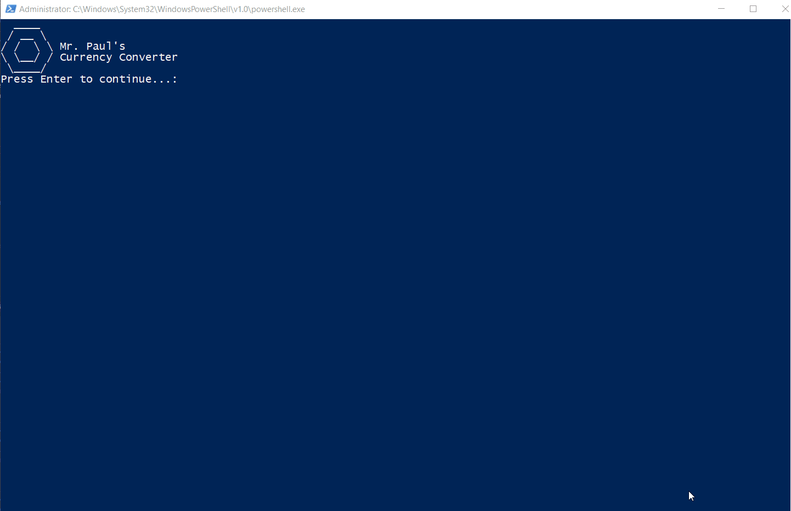

# The DRY & SOLID Currency Converter
## purpose
The aim of this project is to:
  - [x] write a currency converter
  - [x] use Node.Js on the back end
  - [x] follow the DRY and SOLID principles of clean code
  - [x] have a command line UI with powershell
  - [x] separate the UI layer from the main program and support an easy addition / removal of various types of input mechanisms (console, input into sourcefile, csv files)
  - [x] data-validation for the front-end input, checking the currency keys against an array from the requested JSON 
  - [ ] have a **web application** UI / layer

* the idea of the code is to allow as many UIs as possible via the proper separation of the service and UI layer via the proper use of principles of OOP, DRY and SOLID

* this is a **rough sketch**

## instructions
* download, navigate to `./ui > powershell` and run `curcon.bat`
  * **node is required to have on client**
  * **still windows-based, powershell front-end**
* you need to have node installed
* currently, it's running on windows-based powershell, the idea would be to **use powershell-core to have this cross-platform**
* if for any reason you'd like to put the variable inside of the source code, navigate to `sourceFileInput.js` and see the commented section

## demo for the PS UI

## todo
- [ ] **web server:** Node
- [ ] **web UI:** maybe jQuery, but possibly no library or framework, plain stuff
- [ ] **csv input type** could be a possibility to point the script to the `.csv` file to iterate over and create an appended copy with the current conversion rate / result

## sources
* [Foreign exchange rates API](https://exchangeratesapi.io/)
* inspiration by [Agile Tour 2017 Sherbrooke - Keynote with Uncle Bob](https://www.youtube.com/watch?v=VY4LYd2YfBk)